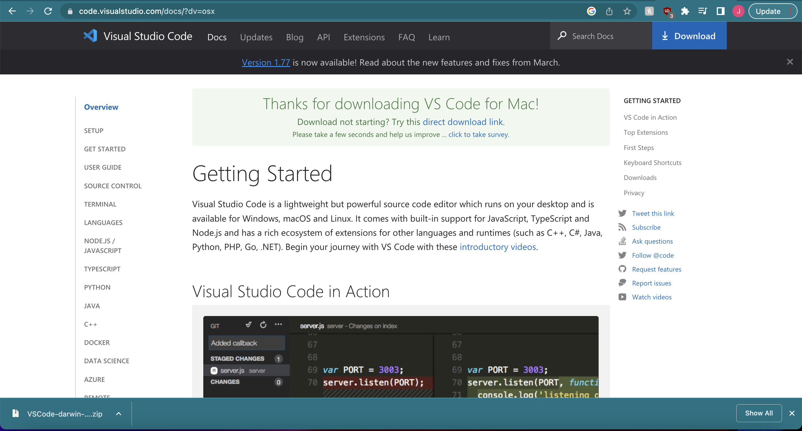
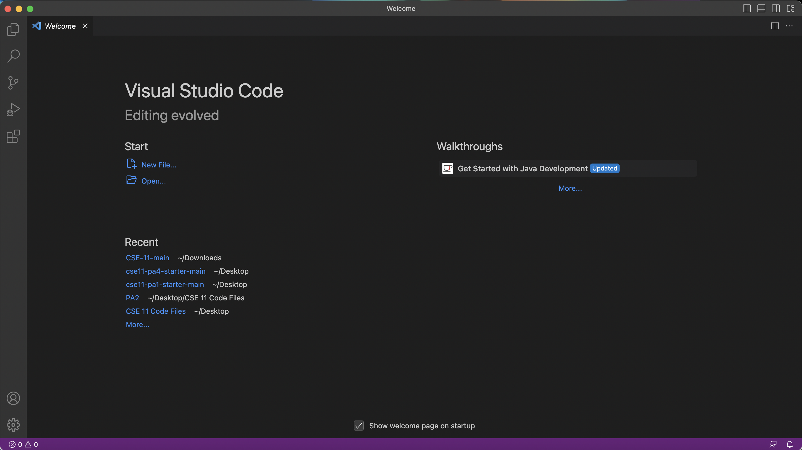

# Lab Report 1

This lab report will demonstrate how to log into a course-specific account on `ieng6`.  

First, you will need to download Visual Studio Code (VSCode). Click [here](https://code.visualstudio.com/download) to go to the download site for VSCode. Be sure to download the one that corresponds with your operating system!

Here's an example of what it should look like if you are on a Mac:  

Click on the downloaded zip folder. It should take you to your downloaded folders, where you will see an application named "Visual Studio Code". Open it up, and it should look something like this upon startup:  

Click on "Terminal" on the top left bar, and then click "New Terminal". Inside the terminal, type "ssh [your-cse15l-username]@ieng6.ucsd.edu", where [your-cse15l-username] should be replaced with your CSE 15L username. 
