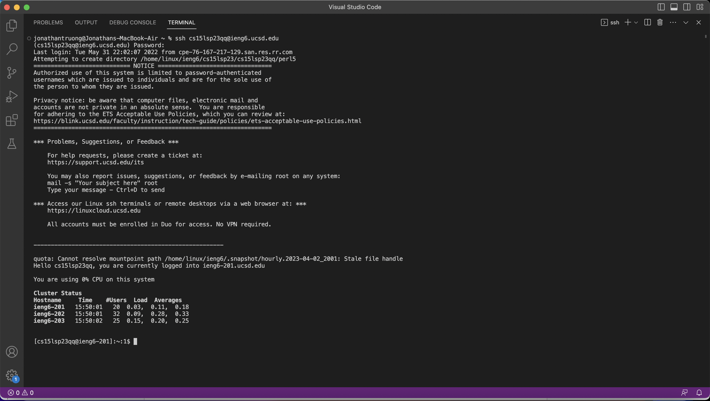
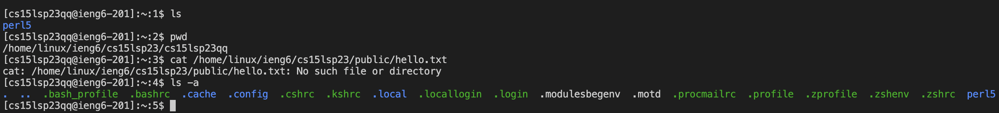

# Lab Report 1

This lab report will demonstrate how to set up remote access by logging into a course-specific account on `ieng6`, particularly for CSE 15L.  

First, you will need to download Visual Studio Code (VSCode). Click [here](https://code.visualstudio.com/download) to go to the download site for VSCode. Be sure to download the one that corresponds with your operating system.

Here's what it should look like if you are on a Mac:  

Click on the downloaded zip folder. It should take you to your downloaded folders, where you will see an application named "Visual Studio Code". Open it up, and it should look something like this upon startup:  

Click on "Terminal" on the top left bar, and then click "New Terminal". Inside the terminal, type "ssh [your-cse15l-username]@ieng6.ucsd.edu", where [your-cse15l-username] should be replaced with your CSE 15L username. The terminal will prompt you to enter your password. Be sure to type it in carefully, as you will not be able to see what you are typing. 

Once you've typed in your password, hit Enter. Your terminal should look something like this:  

At this point, we can start typing in some commands in the command line. Here's a snapshot of 4 examples (`ls`, `pwd`, `cat /home/linux/ieng6/cs15lsp23/public/hello.txt`, and `ls -a`):

Fantastic! You are now able to set up remote access to a computer in the CSE basement and run some commands. 
