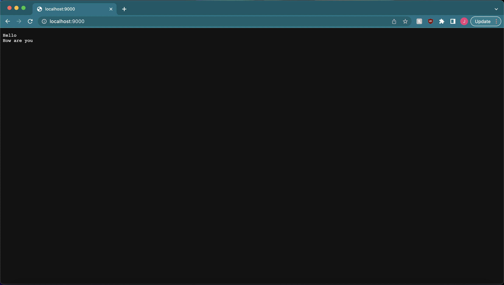
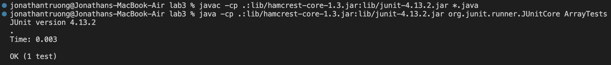
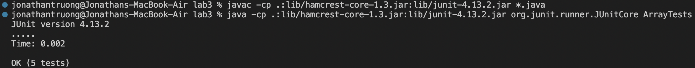

# Lab Report 2

This lab report consists of three parts. Part 1 will discuss the implemetation of a web server named `StringServer`. Part 2 will discuss the method testing of `reverseInPlace()` in the `ArrayExamples.java` file. Part 3 will discuss what I learned during week 2/3 of CSE 15L that I did not know before. 

## Part 1

The implementation of the `StringServer.java` file looks like this: 


When a server request takes the form `/add-message?s=<string>`, the string that follows the `=` will be added to an ArrayList of strings. The page will also display a message "Value added!" to signal that a string has been added to the ArrayList. 

The following two screenshots will demonstrate this type of request in action. The follow screenshot corresponds to `/add-message?s=Hello`:


And this following screenshot corresponds to `/add-message?s=How are you`:


For the previous two requests, the `handleRequest()` method is called upon in the `Handler` class. It takes a `URI` as the argument, which contains the path and query of the request. The if statement in the `handleRequest()` method checks for the contents in the path and the query--if the path has `/add-message` and the query has `s=`, then the server will proceed to add the string that follows the `s=` to the ArrayList named `strList`. 

The else statement runs for any other values of the path or query. What happens is that there is a for loop that will iterate through `strList` and concatenate each element in it with a new line to an empty String named `str`. Note that `str` is only available within the else statement. Once the for loop finishes iterating through `strList`, `str` will be printed onto the page. 

At this point, the `StringServer` page should show:



## Part 2

We will observe the method testing of `reverseInPlace()` in `ArrayExamples.java`. The following code is a test method for `reverseInPlace()`:

```
@Test
public void testOtherReverseInPlace() {
  int[] intArr = {1, 2, 3, 4, 5};
  ArrayExamples.reverseInPlace(intArr);
  assertArrayEquals(new int[] {5, 4, 3, 2, 1}, intArr);
}
```

The input is the integer array `{1, 2, 3, 4, 5}`, and it is expected that `reverseInPlace()` will change it to `{5, 4, 3, 2, 1}`. However, this is a failure-inducing input, as the following message appears:

 method test.png)

The following is the original `reverseInPlace()` method:

```
static void reverseInPlace(int[] arr) {
  for(int i = 0; i < arr.length; i += 1) {
    arr[i] = arr[arr.length - i - 1];
  }
}
```
The issue with this method is that the first element in the array, which is 1, is set to be equal to the last element in the array, which is 5. However, once the for loop finishes iterating through the entire array, the original value of the first element is lost, so the last element (which is 5) never changes because it is set to be equal to the first element in the array, which is 5 because it has changed. This is the same for the second element--it gets set to the value at index 3 (which is 4), but the value at index three will remain unchanged because it is set to be equal to the second element, which is 4 because it has changed. This explains the error message: the method actually changes `{1, 2, 3, 4, 5}` to `{5, 4, 3, 4, 5}`. The first three elements are correct as expected, but the failure message marks the first occurrence of the error at index 3. It is expected that the value at index 3 should be 2, but the error message says that the value at index 3 after calling the `reverseInPlace()` method is actually 4. 

The following code is a test method that is NOT a failure-inducing input:

```
@Test
public void testReverseInPlace() {
  int[] input1 = { 3 };
  ArrayExamples.reverseInPlace(input1);
  assertArrayEquals(new int[]{ 3 }, input1);
}
```
And the following screenshot is the test result for the test above: 



This test doesn't fail because since `input1` is a one-element array, the code is essentially setting it equal to itself, which doesn't help us much and it doesn't weed out any bugs. 

Now, compare the following code to the original code for `reverseInPlace()` above:

```
static void reverseInPlace(int[] arr) {
  for(int i = 0; i < arr.length / 2; i += 1) {
    int num = arr[i];
    arr[i] = arr[arr.length - i - 1];
    arr[arr.length - i - 1] = num;
  }
}
```

A code statement has been added before and after `arr[i] = arr[arr.length - i - 1];`. The purpose of those lines is to prevent the original elements in the array from being lost when they get changed. As a result, what was originally a failure-inducing input no longer produces a failure: 



## Part 3

I've known for some time that Java has some connection with the development of websites, such as applets, but I never knew how they could be implemented. Observing how `NumberServer.java` works and creating a simple search engine expanded my knowledge on how website creation and maintenance are linked to Java. 
