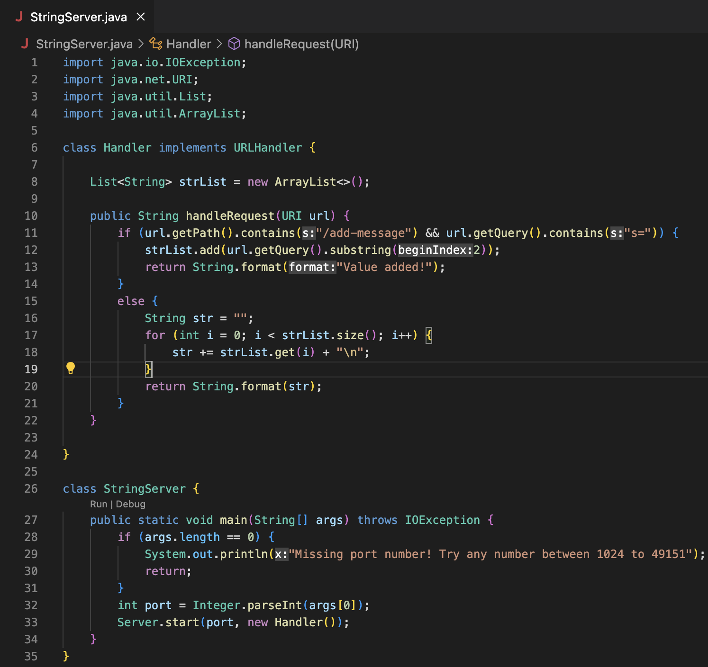
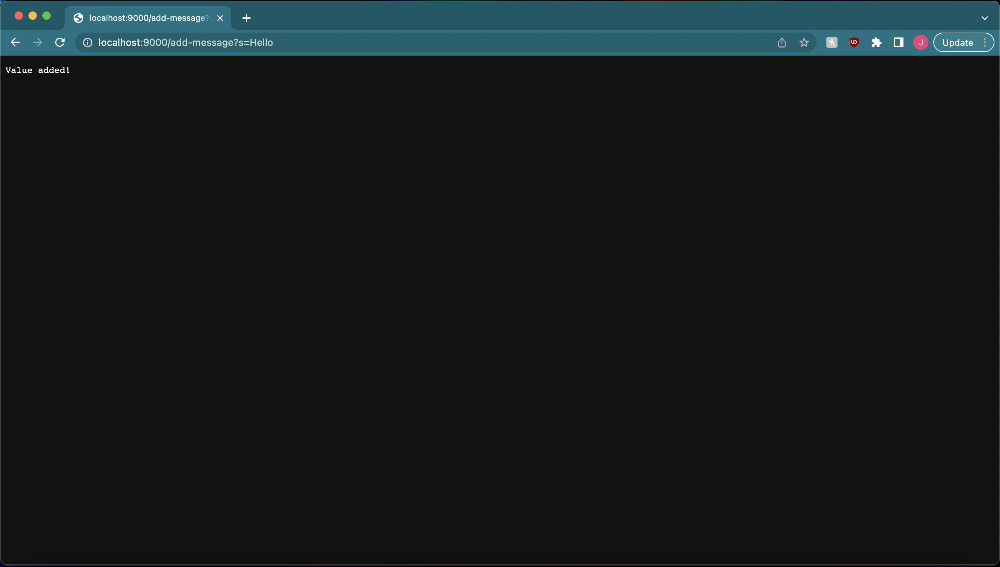
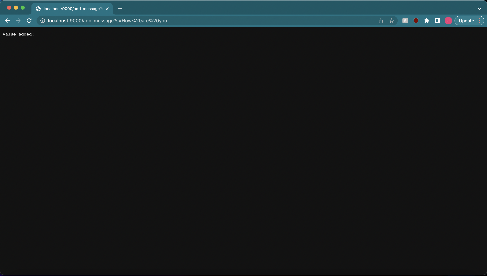

# Lab Report 2

This lab report consists of three parts. Part 1 will discuss the implemetation of a web server named `StringServer`. Part 2 will discuss the method testing of `reverseInPlace()` in the `ArrayExamples.java` file. Part 3 will discuss what I learned during week 2/3 of CSE 15L that I did not know before. 

## Part 1

The implementation of the `StringServer.java` file looks like this: 

When a server request takes the form `/add-message?s=<string>`, the string that follows the `=` will be added to an ArrayList of strings. The page will also display a message "Value added!" to signal that a string has been added to the ArrayList. 

The following two screenshots will demonstrate this type of request in action. The follow screenshot corresponds to `/add-message?s=Hello`:

And this following screenshot corresponds to `/add-message?s=How are you`:

## Part 2

## Part 3
