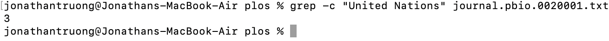
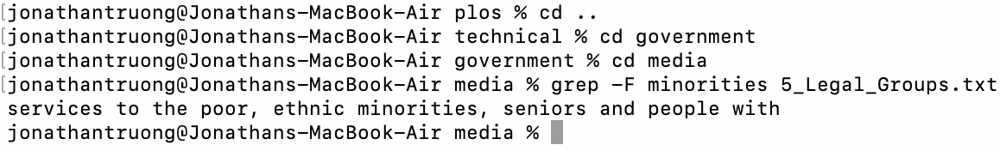
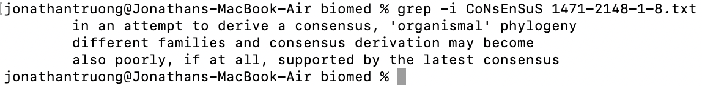
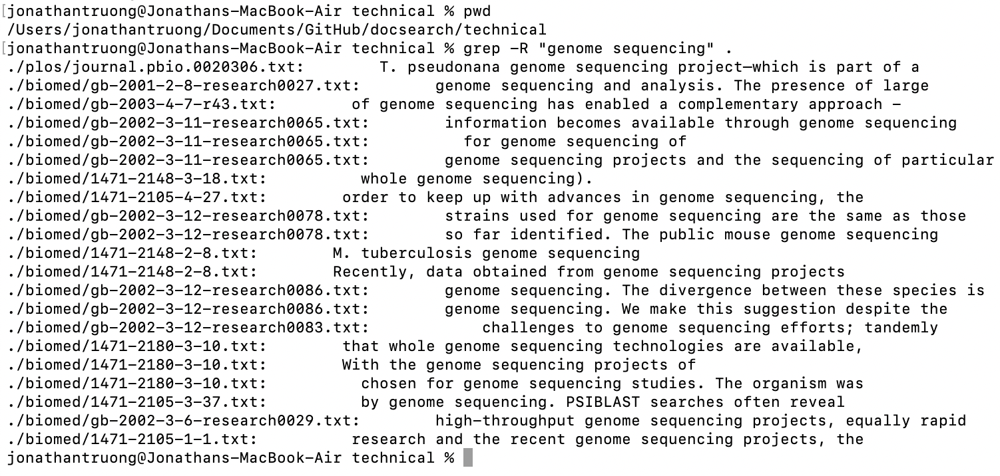
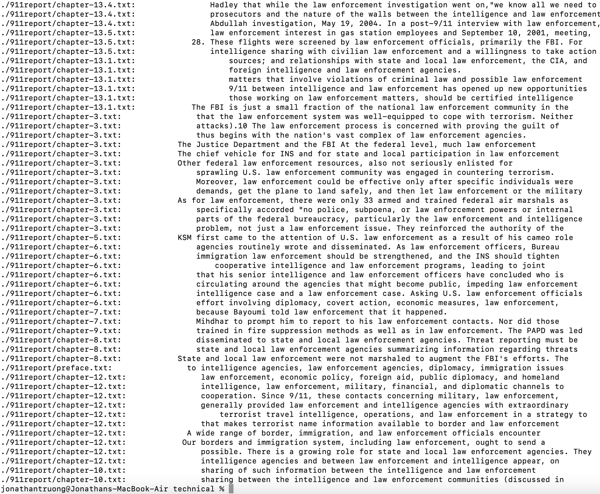

# Lab Report 3

This lab report will discover four alternate uses of the line command `grep` (`grep -c`, `grep -F`, `grep -i`, and `grep -R`) on files and directories from `./technical`. 

## `grep -c`

`grep -c` is one of of the alternate uses of `grep`, and the command line takes the form `grep -c [key-word] [file-name]`. `[key-word]` is the string you would like to search for, and `[file-name]` is the name of the file you would like to search that string in.

### Example 1: 

Using the text file `chapter-1.txt` from the relative path `/technical/911report`, I typed in the command 

```
grep -c flight chapter-1.txt
```

to find the number of occurrences of the word `flight` in the text file `chapter-1.txt`. The following is a screenshot of the results:


This shows that the word `flight` appears 74 times in the text file `chapter-1.txt`. 

### Example 2: 

Using the text file `journal.pbio.0020001.txt` from the relative path `/technical/plos`, I typed in the command 

```
grep -c "United Nations" journal.pbio.0020001.txt
```

to find the number of occurrences of `United Nations` in the text file `journal.pbio.0020001.txt`. The following is a screenshot of the results:



This shows that `United Nations` appears 3 times in the text file `journal.pbio.0020001.txt`. 

`grep -c` essentially searches throughout the file for the specified keyword, and will return the number of occurrences of that keyword. This could be particularly useful for determining how important certain words or terms are in a paper. 

## `grep -F`

`grep -F` is a `grep` alternate that prints out all the lines in a certain file that contains a specified keyword. This command takes the form `grep -F [key-word] [file-name]`. 

### Example 1

After switching to the `biomed` directory in `technical`, I typed the following command:

```
grep -F polar 1471-2148-1-14.txt
```

The following is a screenshot of the results: 


The command searched throughout `1471-2148-1-14.txt` and determined that there were two lines that contained the word `polar`. So as a result, two lines from that text file were printed. 

### Example 2

I switched to the `government` directory, and accessed its `Media` directory. I then typed the following command:

```
grep -F minorities 5_Legal_Groups.txt
```

The following is a screenshot of the results:



The command searched throughout `5_Legal_Groups.txt` and only found one line that contained the word `minorities`. That line was then printed.

`grep -F` essentially searches for which lines in a text file contain the specified keyword and prints them. This could be useful in discovering the surrounding context of that keyword within the text file. 

## `grep -i`

`grep -i` is a `grep` alternate that searches through a text file for a particular keyword, but ignores case sensitivity. 

### Example 1

Recycling the first example from `grep -F`, I typed the command:

```
grep -i POLAR 1471-2148-1-14.txt
```

The following is a screenshot of the results:


This command will have the same output as `grep -F polar 1471-2148-1-14.txt`! So even though the keyword is `POLAR`, lines that contain `polar` are still printed.

### Example 2

Switching back to the `biomed` directory, I typed in the following command:

```
grep -i CoNsEnSuS 1471-2148-1-8.txt
```

The following is a screenshot of the results:



This command will print out three lines that contain `consensus` because the search is not case sensitive. 

Because `grep -i` is not case sensitive, it could be useful for finding lines with that particular word that the normal `grep` command might not normally find. 

## grep -R

`grep -R` is a `grep` alternate that searches through the current directory and its subdirectories for files that contain a specified keyword. It takes the form `grep -R [key-word] .`. 

### Example 1

After switching the current directory to `technical`, I typed the command:

```
grep -R "genome sequencing" .
```

The following is a screenshot of the results:



This command lists out the relative paths of the files that contain the keyword "genome sequencing" and prints out the lines that contain `genome sequencing`. It looks like one text file from the `plos` directory and many text files from the `biomed` directory contain `genome sequencing`. 

### Example 2

Staying in the `technical` directory, I typed in another command:

```
grep -R "law enforcement"
```

The following is a screenshot of the results:




This command lists out the relative paths of the files that contain the keyword "law enforcement" and prints out the lines that contain `law enforcement`. It looks like text files from directories `government`, `biomed`, and `911report` have the keyword `law enforcement`. 

`grep -R` is useful for determining which files (including ones housed in subdirectories) contain a specified keyword. If the current directory is especially large and cluttered, this `grep` alternative will also list the relative path to the text file, which can help us locate it easily. 

## Linked Used

The following is the link I used to discover alternates of the `grep` command: https://www.cyberciti.biz/faq/howto-use-grep-command-in-linux-unix/ 
