# Lab Report 4

This lab report will execute the following steps of CSE 15L's Week 7 Lab Activity. These steps are:
1. Log into ieng6
2. Clone your fork of the repository from your Github account
3. Run the tests, demonstrating that they fail
4. Edit the code file to fix the failing test
5. Run the tests, demonstrating that they now succeed
6. Commit and push the resulting change to your Github account (you can pick any commit message!)

## Step 1

First, we will log into the `ieng6` account. Note that this time, the terminal isn't prompting the user to enter the password-that's because an SSH key has been created for the `ieng6` account so that we no longer have to enter in the password. Sweet! 

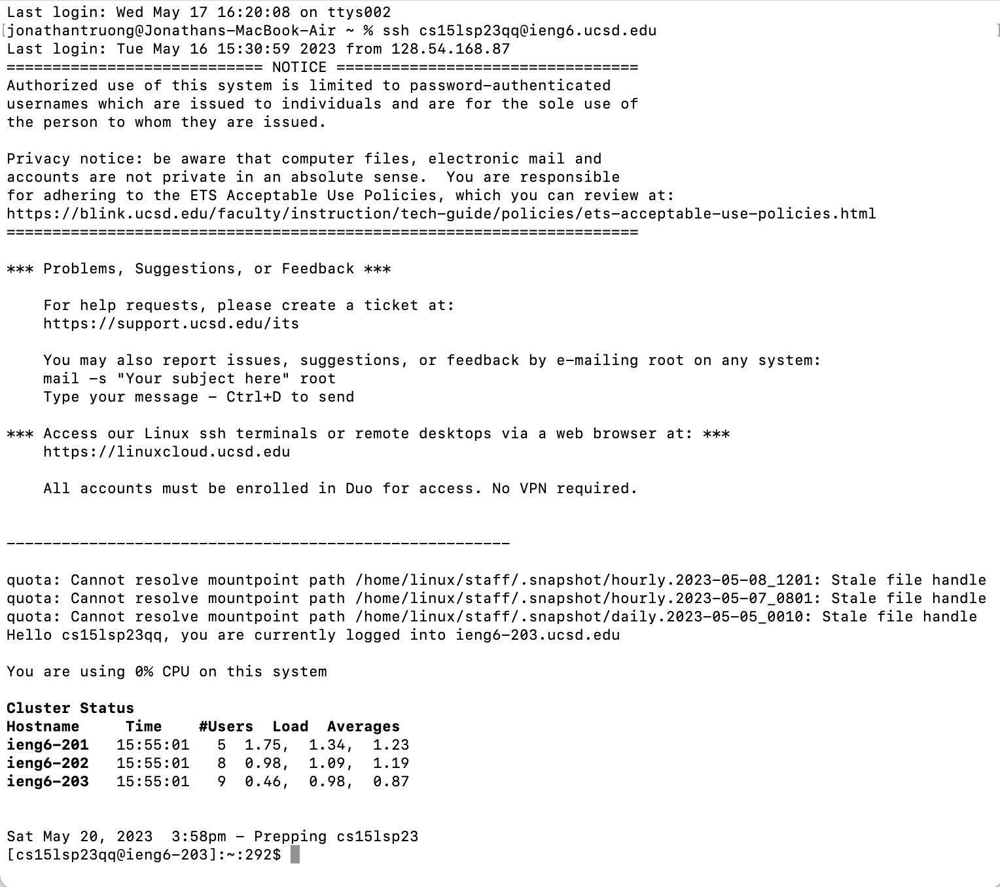

Keys pressed: `ssh<space>cs15lsp23qq<shift-2>ieng6.ucsd.edu<enter>`

## Step 2

Now that we're logged in, let's clone this repository on GitHub: https://github.com/ucsd-cse15l-s23/lab7.git/ 

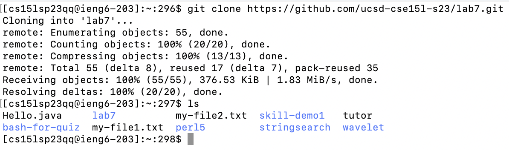

Keys pressed: `git<space>clone<space><Command+v><enter>ls<enter>`

(Note: `<Command+v>` refers to pasting the link to the GitHub repository (https://github.com/ucsd-cse15l-s23/lab7.git/), so be sure to copy the link first and then pasting it into the terminal.)

## Step 3
  
Now, we must show that by running the tests in the `.java` files, we get failures. First, we must get into the `lab7` directory:
  
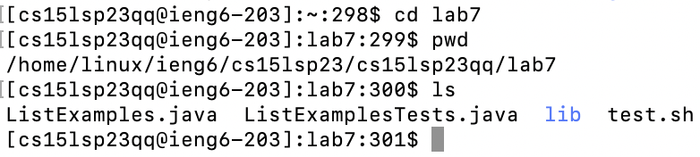
  
Keys pressed: `cd<space>lab7<enter>pwd<enter>ls<enter>`

Next, we will compile `ListExamples.java` and `ListExamplesTests.java` simultaneously using the `javac` command:

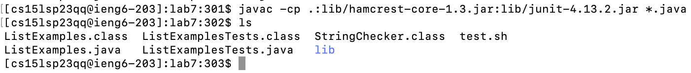

Keys pressed: `javac<space><Command+v><space><shift+8>.java<enter>ls<enter>`

(Note: `<Command+v>` refers to pasting `-cp .:lib/hamcrest-core-1.3.jar:lib/junit-4.13.2.jar`.)

And finally, we show that there are errors in the tests using the `java` command:

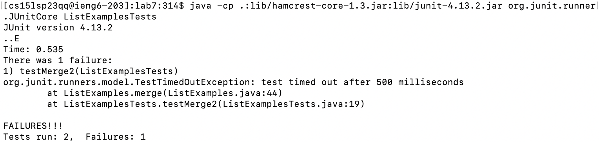

Keys pressed: `java<space><Command+v><space><shift+l>ist<shift+e>xamples<shift+t>ests<enter>`

(Note: `<Command+v>` refers to pasting `-cp .:lib/hamcrest-core-1.3.jar:lib/junit-4.13.2.jar org.junit.runner.JUnitCore`.)

## Step 4

Not to worry, we can fix the issue by editing the file directly from the terminal! It turns out that the issue is in the `ListExamples.java` file. To get into that file, first type `vim ListExamples.java`:

After pressing enter, this is what the terminal should look like:
  
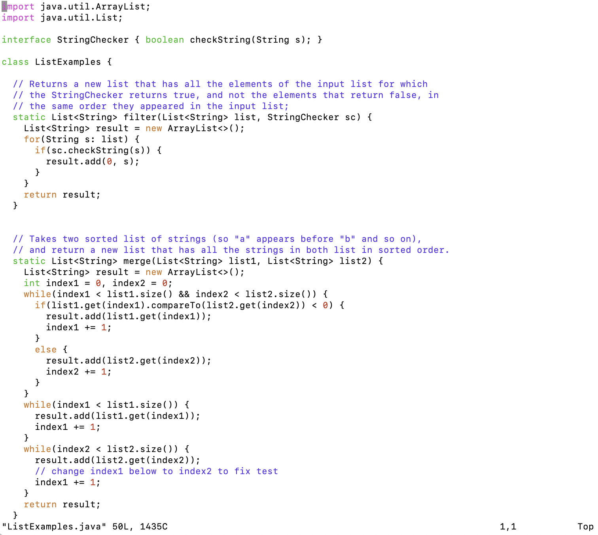
  
Keys pressed: `vim<space><shift+l>ist<shift+e>xamples.java<enter>`

Now, type `/index1`, and press enter. What this does is that it searches through the file for the keyword `index1`. Then, do the following:
1. Press n 9 times. This get us to the second occurence of `index1` in the third while loop. 
2. Press l 5 times. This moves the cursor to the right 5 times. 
3. Press x 1 time. This deletes the last character off of `index1`, so it should be `index` after x is pressed.
4. Press i 1 time. This enters `Insert` mode in `vim`.
5. Press 2 1 time. This types out "2". 
  
What we essentially did was change `index1` to `index2` in the third while loop (not the `index1` that's commented). This is the main reason why there was a failure during testing. Here's what `ListExamples.java` should look like after the above steps:

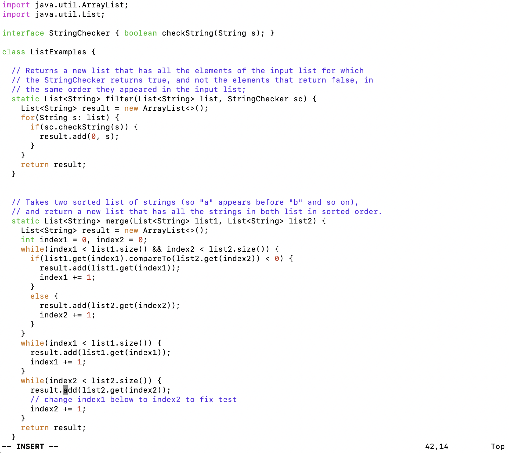

Now, let's exit out of `vim` mode. Press escape, then type in `:wq` and press enter. This should get us back to the terminal. 

## Step 5

Let's try running the tests again: 

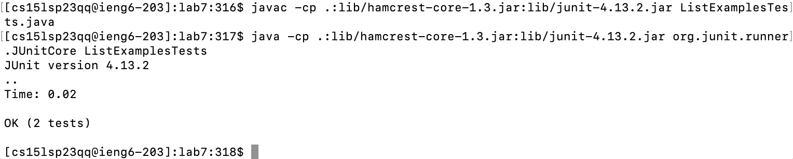

Keys pressed: `<up><up><up><up><up><enter><up><up><up><enter>`

(Note: Things did not go perfectly when I ran the steps myself and I typed in a number of commands in between the commands discussed in this lab report. When using the up arrow, press it as many times as necessary until you see the `javac` and `java` command as seen in step 3 because it may not be exactly 5 times to find the `javac` command and exactly 3 times for the `java` command. And as always, run the `javac` command first, then the `java` command.)

Nice! There are no failures. 

## Step 6

Now, it's time to commit and push our code to the GitHub account. For the git command, type `git commit -m "[message]"`. In this case, `[message]` will be `updated`:

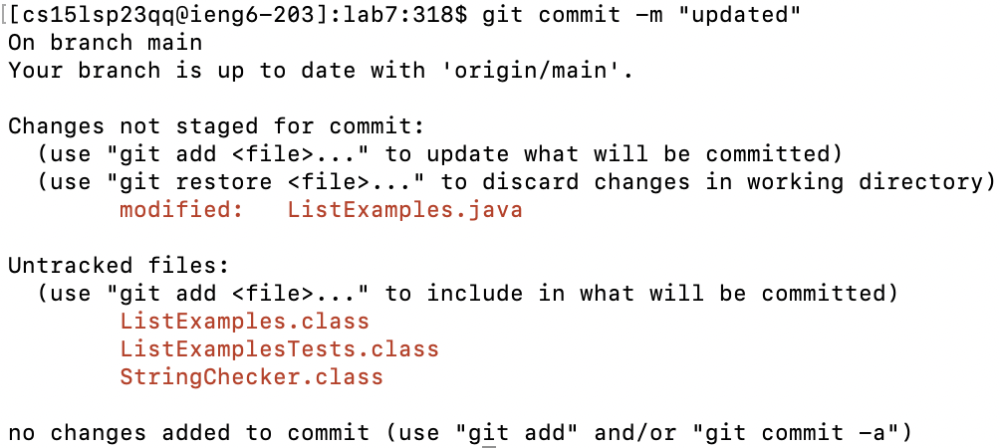

After the message pops up, type in `git push <URL> main`, where URL is the link to the GitHub repository. In this case, I will use the SSH key that is found here:
  
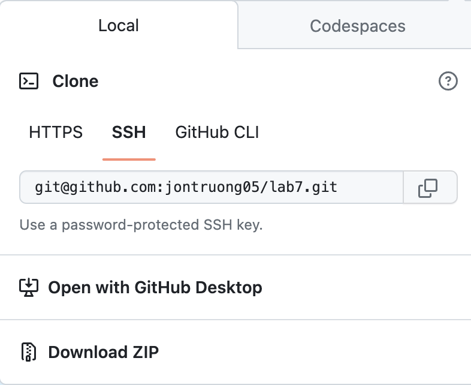

Here is the result of the `git push` command:

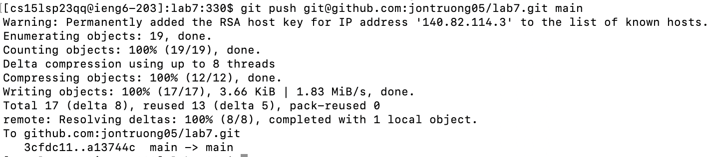

Keys pressed for `git commit` command: `git<space>commit-m<shift+'>updated<shift+'><enter>`

Keys pressed for `git push` command: `git<space>push<space><Command+v><space>main<enter>`

(Note: `<Command+v>  for the `git push` command refers to pasting `git@github.com:jontruong05/lab7.git/`.)

A change was only made to `ListExamples.java`, so let's confirm that it has been changed on the GitHub site:

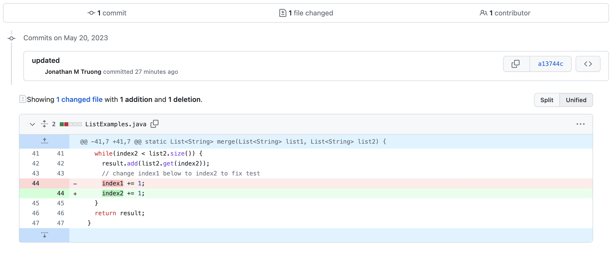

Notice how `index1` on line 44 got changed to `index2`. This shows that the `git` commands did their thing!
